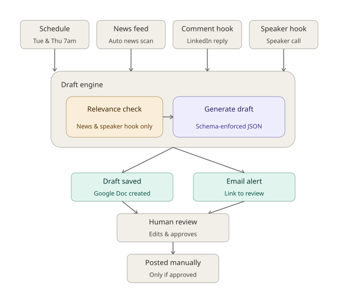

# B2B thought-leadership content agent

A human-in-the-loop content automation system: four Make.com workflows that research, judge relevance, and draft on-brand LinkedIn content — then stop. Every path ends at "draft saved, human notified." Nothing auto-posts, nothing auto-sends.



## What it does

| Workflow | Trigger | Output |
|---|---|---|
| Scheduled post | Cron (Tue/Thu) | Standalone post grounded in recent industry news |
| Breaking-news monitor | RSS poll | Timely reaction, gated by a relevance classifier |
| Engagement comment | Webhook | Specific, non-generic reply to another post |
| Speaker radar | Webhook | Event-specific outreach draft, gated by a confidence threshold |

Full write-up of the architecture, design decisions, and what building it surfaced: **[CASE_STUDY.md](CASE_STUDY.md)**

## Workflows in action

<table>
<tr>
<td align="center"><br><b>WF1 — Scheduled post</b></td>
<td align="center"><br><b>WF2 — Breaking-news monitor</b></td>
</tr>
<tr>
<td align="center"><br><b>WF3 — Engagement comment</b></td>
<td align="center"><br><b>WF4 — Speaker radar</b></td>
</tr>
</table>

## Repo structure

```
.
├── CASE_STUDY.md          # architecture, engineering decisions, lessons learned
├── diagrams/
│   └── architecture.svg   # system architecture diagram
├── workflows/            # Make.com scenario exports, importable as-is
│   ├── WF1_scheduled_post.blueprint.json
│   ├── WF2_breaking_news_monitor.blueprint.json
│   ├── WF3_engagement_comment.blueprint.json
│   └── WF4_speaker_radar.blueprint.json
└── assets/
    ├── system_prompt.txt          # the agent's brain — persona, voice, output contract
    ├── brand_tone_guidelines.md   # voice reference + worked examples
    ├── output_schema.json         # the structured draft contract
    ├── gemini_generate_body.json  # reusable Gemini request template (drafting)
    └── gemini_classify_body.json  # reusable Gemini request template (relevance)
```

## Key design decisions

- **Schema-enforced structured output**, not just prompt instructions — Gemini's `responseSchema` parameter, not "please return this JSON shape." See CASE_STUDY.md for why this mattered in practice.
- **Idempotent by construction** — a hashed-key data store, not a hope that duplicates won't happen.
- **Confidence-gated, not just relevance-gated** — a numeric threshold, tuned against both a genuine positive case and a deliberately similar negative case.
- **Provider-agnostic** — the LLM call is a plain REST request; swapping Gemini for Claude, or Google Docs for OneDrive, is a one-module change.
- **No autonomous publishing path** — every workflow's furthest action is save + notify.

## Stack

Make.com · Gemini API · Claude API (documented alternative) · Google Drive / Docs / Gmail · JSON Schema

---

*The persona in `assets/system_prompt.txt` (a neuro-performance consultant) is a labeled portfolio placeholder. Swapping in a real client's brand voice is a two-file edit — see CASE_STUDY.md.*
